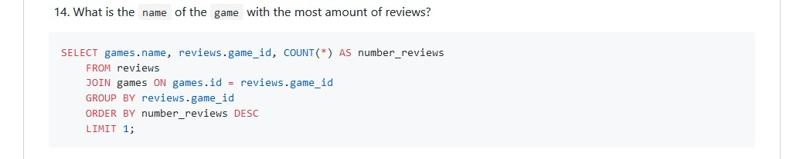

# Exercise checklist

Please read the following guidelines very carefully and check all your exercises
to make sure you comply to all of them.

## No name in `README.md` file

Please make sure to fill in your name at the marked space at the top of the document.

Also note that the 'Markdown Linter' badge should be visible in the resulting
document if viewed on GitHub.com

---

## Mergeconflicts in `README.md` file

Please solve any mergeconflicts that may occur in your project.

### 👎 Bad ❌️

### 👍 Good ✔️

---

## No exercises marked

**Exercises that are not marked will not be reviewed !!!** Make sure to mark all the
completed exercises. Do not mark any exercises that are not completed.

### 👎 Bad ❌️

### 👍 Good ✔️

---

## Markdown markup ignored

**Check ALL documents for markup errors**. View all your documents on GitHub to
verify the markup is correctly. In vscode you can use the markdown preview to
inspect the markdown result (press `F1` -> `Markdown: Open preview at the side`).

If markdown is unreadable, **the document will not be reviewed**.

### 👎 Bad ❌️

### 👍 Good ✔️

## Check for linter errors

Make sure you have no Markdown linter errors in your project.
You can watch the result of the linter on GitHub in your commit list.

You can also inspect the warnings and errors in VSCode using the following extension: 
https://marketplace.visualstudio.com/items?itemName=DavidAnson.vscode-markdownlint

## Make sure you ONLY give valid SQL answers

The `MariaDB [database_name]>` and `-->` are parts of the mysql client, but are
NOT valid SQL code. Please remove these marks, as the results cannot be executed
and verified by running them again.

### 👎 Bad ❌

### 👍 Good ✔️

